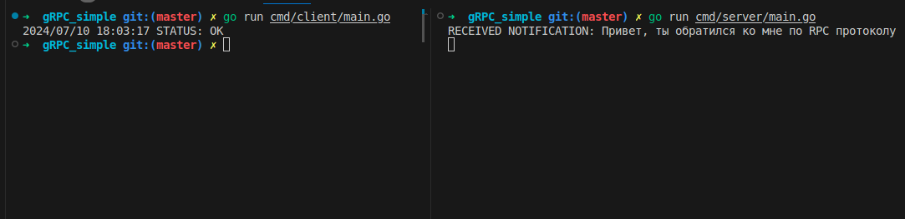

# Простой gRPC сервер и клиент

## Технологии 
- Golang
- библиотеки: 
    - google.golang.org/grpc 

## Использование 
- Установите последнею версию **go**
- Установите зависимости
https://grpc.io/docs/languages/go/quickstart/#prerequisites

- Запустите сервер командой:

```go
    go run cmd/server/main.go
```

- Запустите клиента командой:

```go
    go run cmd/client/main.go
```

## Вывод в консоли
